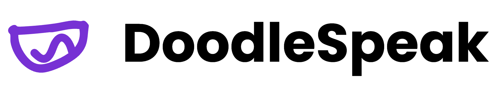
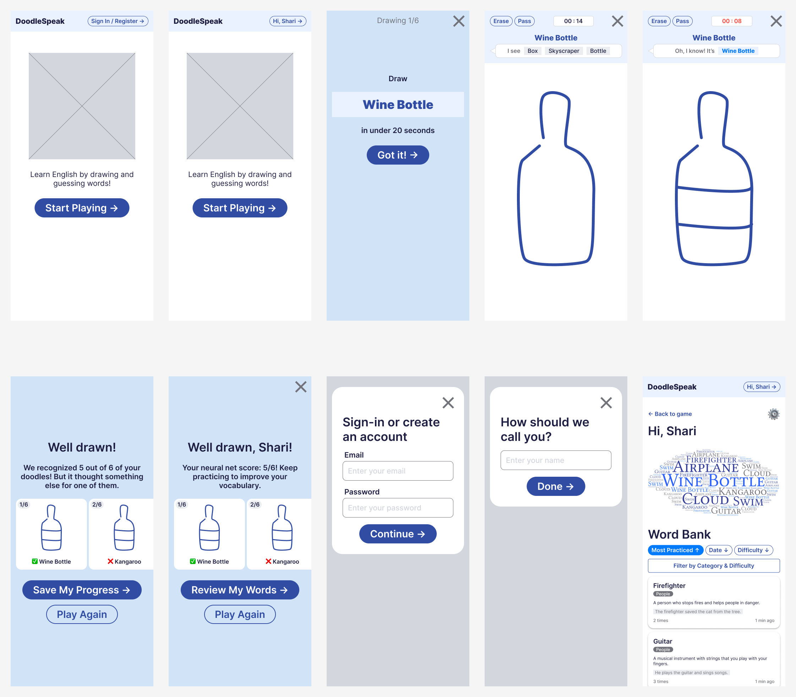
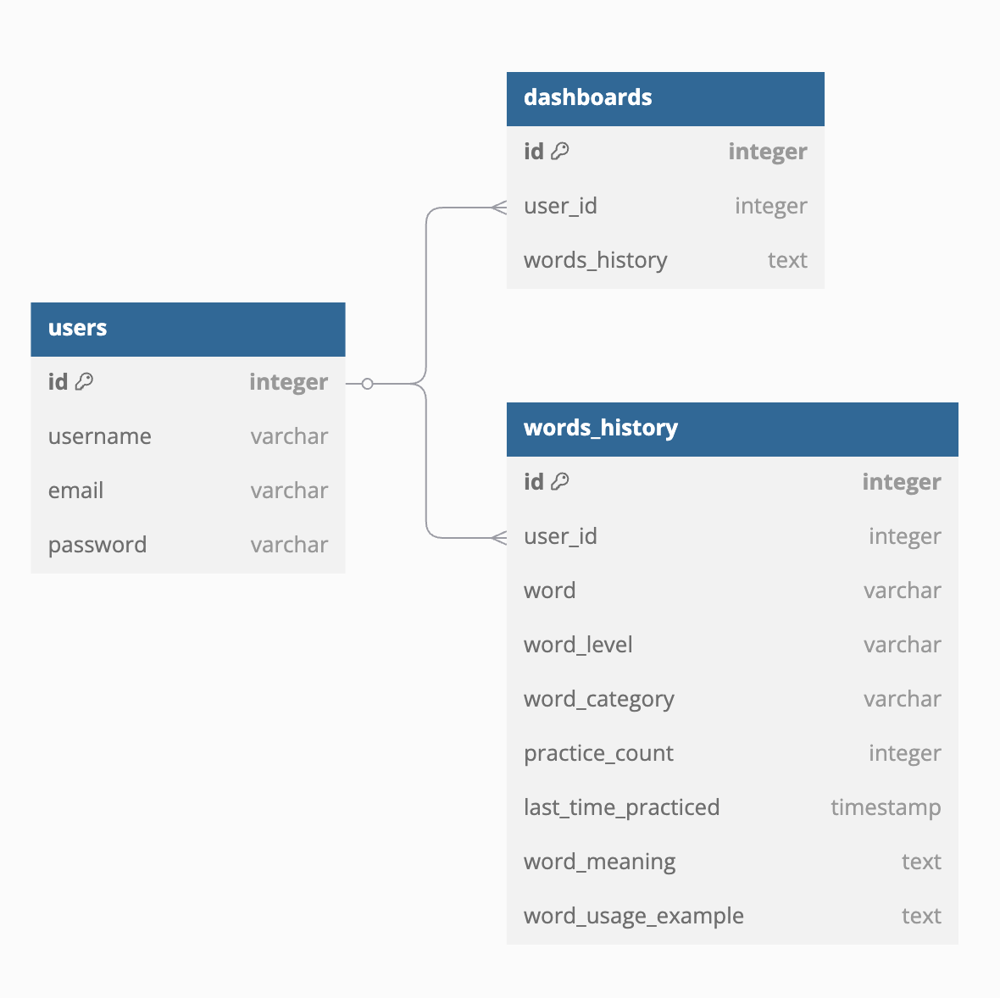
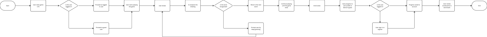
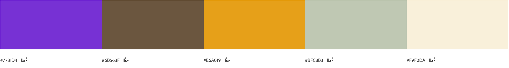

# DoodleSpeak

DoodleSpeak is a fun AI-powered Pictionary game for learning English vocabulary. Users draw words, and the AI guesses them, helping players improve their vocabulary through visual engagement and repetition.

## Deployment
[DoodleSpeak Live](https://doodlespeak-c9a180f0ef00.herokuapp.com/)

## Responsiveness

## Wireframe

## Database Structure

## Flow Chart

## Logo and Color Scheme
- **Logo:** 
- **Color Scheme:** 

## Features
- 🎨 **AI-Powered Drawing Recognition** – Users draw words while AI guesses in real time.
- 📖 **Vocabulary Tracking** – Words learned are saved for review.
- ☁️ **Word Cloud Visualization** – Displays frequently practiced words.
- 🔄 **Play Again & Progress Saving** – Users can replay and track their learning journey.

## Tech Stack
- **Frontend:** HTML, CSS (Bootstrap, FontAwesome), JavaScript
- **Backend:** Python, Django
- **AI & Machine Learning:** Google Cloud Vision API
- **Database:** PostgreSQL
- **Hosting & Deployment:** Heroku, GitHub

## Usage
1. Visit the website and start playing as a guest or log in.
2. Draw the given word while the AI tries to guess it.
3. Complete 6 rounds, then review learned words.
4. Save progress by creating an account.
5. Track vocabulary growth in the dashboard with a word cloud.
6. Study and review words within your word bank.

## Acknowledgments
- Google Cloud Vision API for AI-based drawing recognition.
- Bootstrap for responsive UI components.
- FontAwesome for icons.
- wordcloud2.js for word cloud.